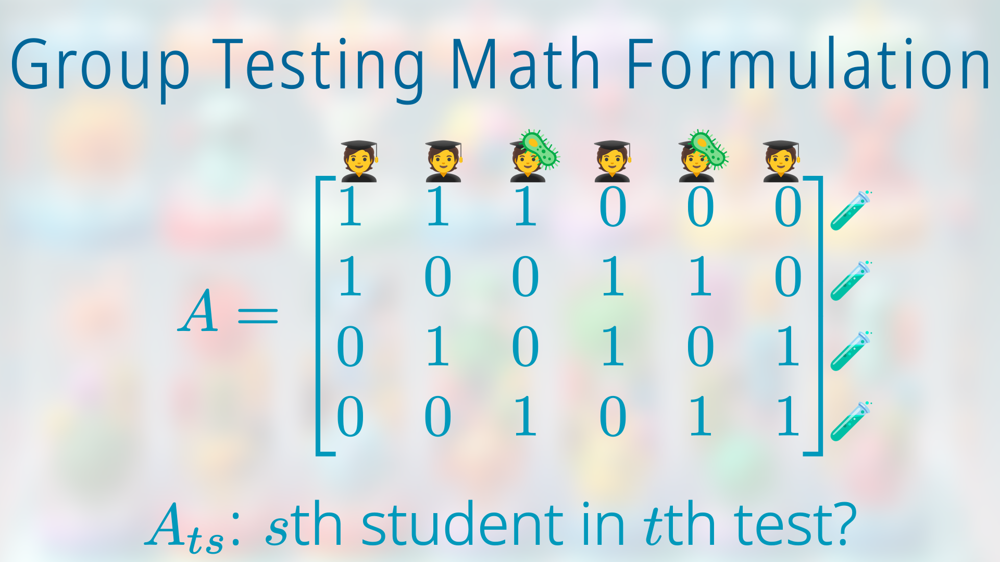

# Group Testing via Stacked List Recoverable Codes

This presentation is based on
a joint work with Venkatesan Guruswami:
[Noise-Resilient Group Testing with Order-Optimal Tests and Fast-and-Reliable Decoding](https://arxiv.org/abs/2311.08283).

## The Jupyter notebook

In order to compile, you need to install fonts

* `Noto Sans Light`
* `Noto Sans Display`

In order to compile, you also need to download
[Noto Emoji](https://github.com/googlefonts/noto-emoji)
to your working folder such that
`noto-emoji-main/png/512/emoji_u????.png`
does point to actual pictures.

You also need make sure that these pictures exist
(and are in the correct folders).

* `gacha.jpg`
* `papers/BCS21.png`
* `papers/CGH21.png`
* `papers/ChN20.png`
* `papers/CJB17.png`
* `papers/CJS14.png`
* `papers/JAS19.png`
* `papers/KaS64.png`
* `papers/PST23.png`
* `papers/Sca19.png`
* `papers/WGG23.png`

## The Keynote file

I use Manim in a Jupyter notebook to generate
static image slides and video slides.
I then import them into a Keynote file.

The reason to put video in a Keynote/Powerpoint file
(instead of chaining them into a single video)
is because audiences might ask questions,
and it is easier to control timing this way.

You see three files

* `GachaManim-25.key`
* `GachaManim-26.key`
* `GachaManim-27.key`

here because GitHub has a 25MB file size limit.

## Preview

---

---

---

---

---

---

---

---

---

---

---

---

---

---

---

---

---

---

---

---

---

---

---

---

---

---

---

---

---

---

---

---

---

---

---

---

---

---

---

